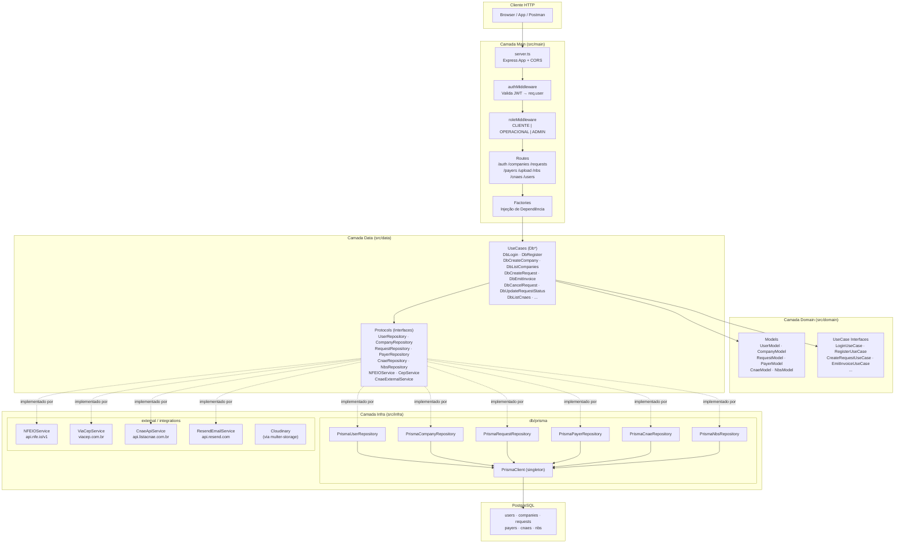
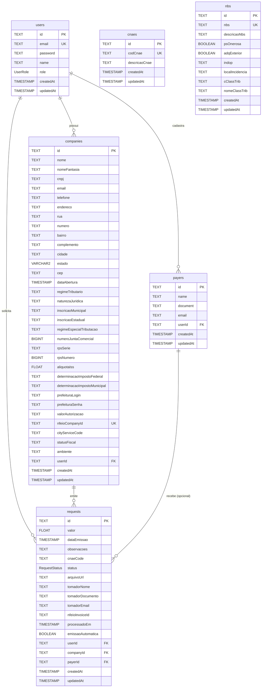
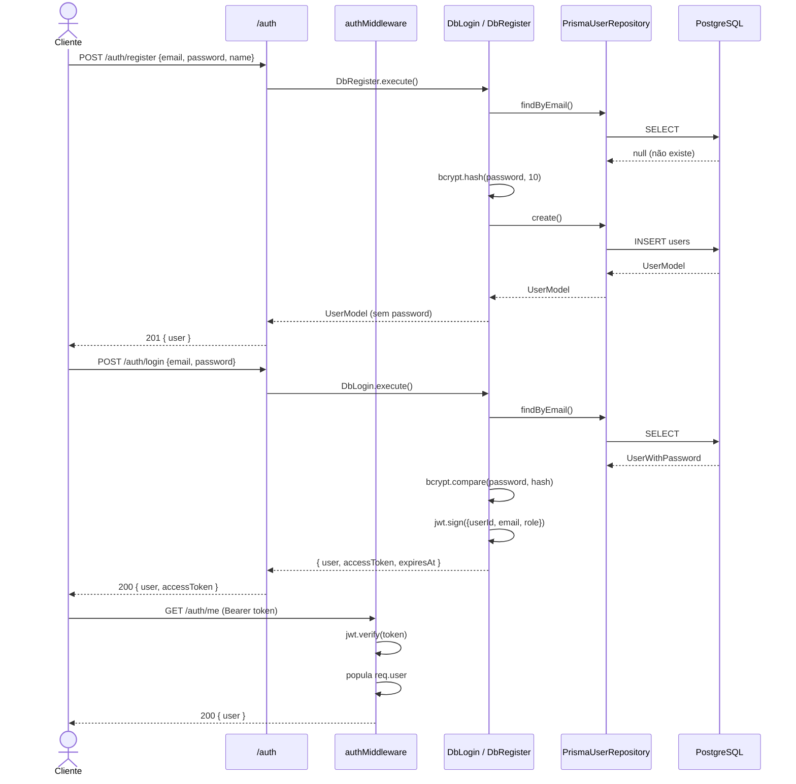
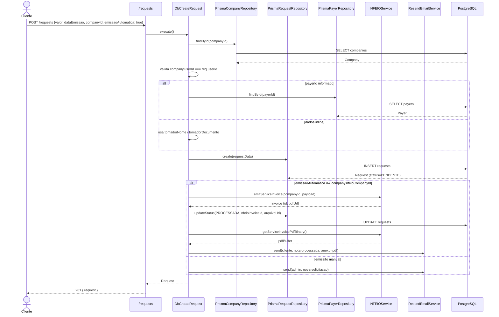
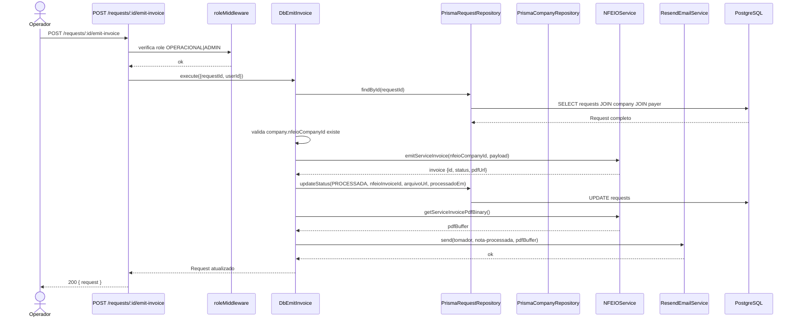
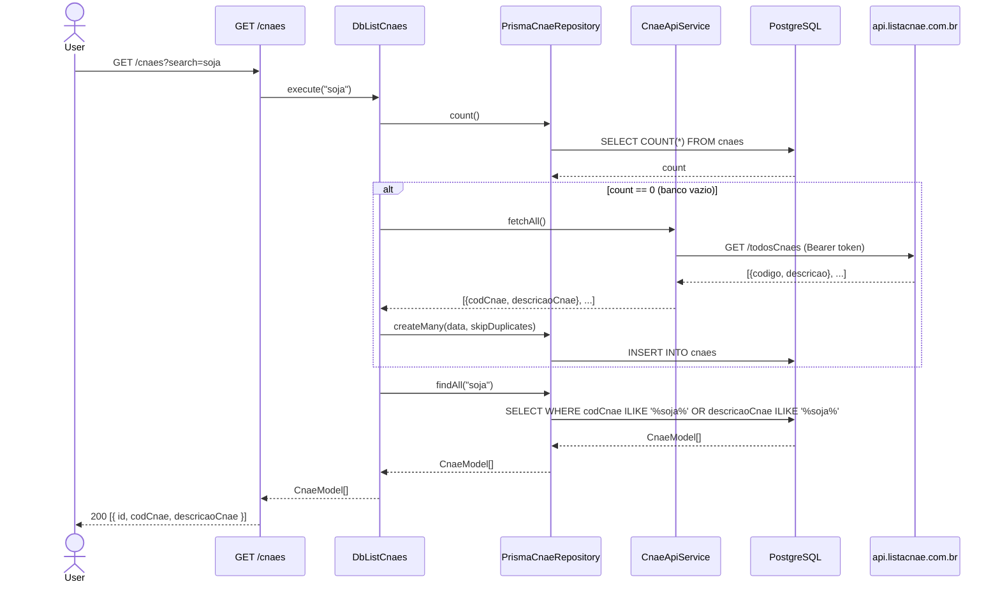
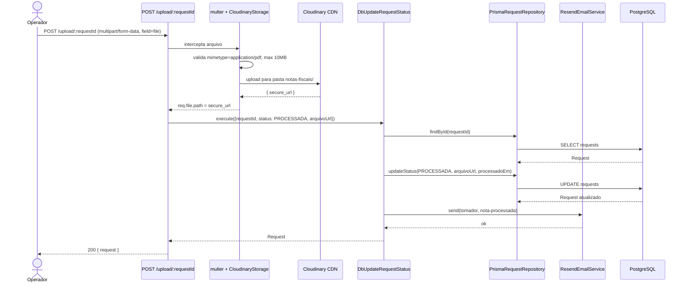
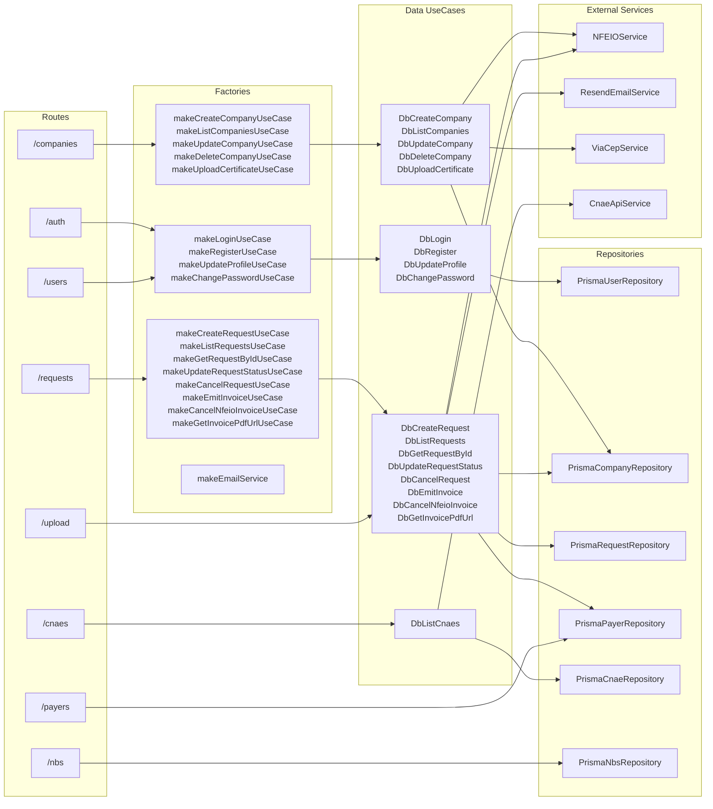
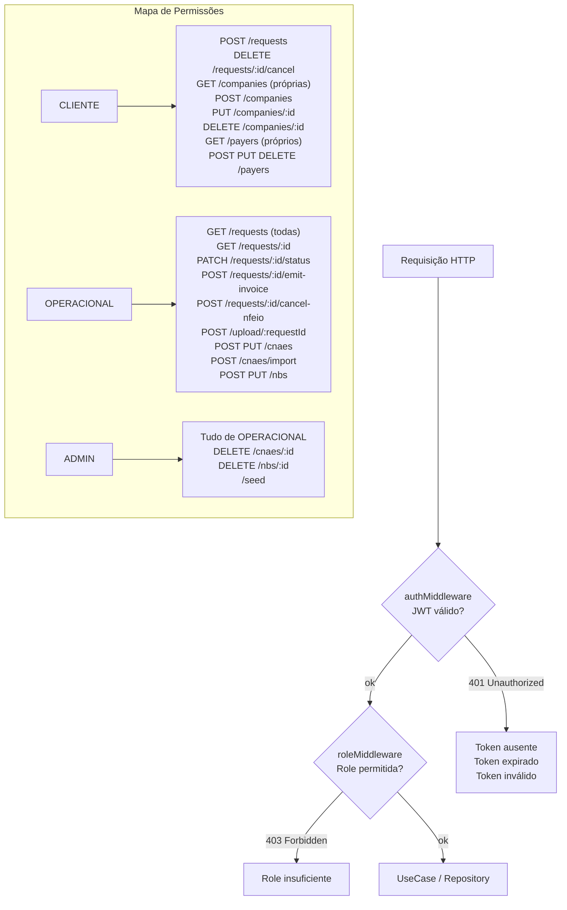

# Arquitetura & Contrato da API — IAContabil

## 1. Visão Geral das Camadas (Clean Architecture)



---

## 2. Diagrama Entidade-Relacionamento



---

## 3. Fluxo de Autenticação



---

## 4. Fluxo de Criação de Solicitação (com emissão automática)



---

## 5. Fluxo de Emissão Manual de Nota



---

## 6. Fluxo de CNAEs (Cache-First com BD Local)



---

## 7. Fluxo de Upload de PDF



---

## 8. Mapa Completo de Dependências por Camada



---

## 9. Roles e Permissões por Endpoint



---

## 10. Contrato da API

### Base URL
```
http://localhost:3333
```

### Autenticação
Todos os endpoints (exceto `/auth/register` e `/auth/login`) exigem:
```
Authorization: Bearer <jwt_token>
```

---

### `/auth` — Autenticação

#### `POST /auth/register`
Cria um novo usuário.

**Body:**
```json
{
  "email": "string (email válido)",
  "password": "string (mín. 1 char)",
  "name": "string (mín. 2 chars)"
}
```

**Response 201:**
```json
{
  "id": "uuid",
  "email": "string",
  "name": "string",
  "role": "CLIENTE",
  "createdAt": "ISO8601",
  "updatedAt": "ISO8601"
}
```

**Erros:** `400` dados inválidos · `409` email já cadastrado

---

#### `POST /auth/login`
Autentica e retorna JWT.

**Body:**
```json
{
  "email": "string",
  "password": "string"
}
```

**Response 200:**
```json
{
  "user": {
    "id": "uuid",
    "email": "string",
    "name": "string",
    "role": "CLIENTE | OPERACIONAL | ADMIN"
  },
  "accessToken": "jwt_string",
  "accessTokenExpiresAt": "ISO8601"
}
```

**Erros:** `400` dados inválidos · `401` credenciais incorretas

---

#### `GET /auth/me`
Retorna o usuário autenticado.

**Response 200:**
```json
{
  "id": "uuid",
  "email": "string",
  "name": "string",
  "role": "string",
  "createdAt": "ISO8601",
  "updatedAt": "ISO8601"
}
```

---

### `/users` — Perfil

#### `PUT /users/profile`
Atualiza nome e/ou email.

**Body:**
```json
{
  "name": "string (opcional)",
  "email": "string email (opcional)"
}
```

**Response 200:** `UserModel`

---

#### `PUT /users/password`
Altera a senha.

**Body:**
```json
{
  "currentPassword": "string",
  "newPassword": "string"
}
```

**Response 200:** `{ "message": "Senha alterada com sucesso" }`

**Erros:** `400` senha atual incorreta

---

### `/companies` — Empresas

#### `GET /companies`
Lista empresas do usuário autenticado.

**Response 200:** `CompanyModel[]`

---

#### `POST /companies`
Cadastra nova empresa.

**Body:**
```json
{
  "nome": "string",
  "cnpj": "string",
  "email": "string",
  "telefone": "string",
  "endereco": "string",
  "cidade": "string",
  "estado": "string (2 chars)",
  "cep": "string",
  "nomeFantasia": "string (opcional)",
  "regimeTributario": "string (opcional)",
  "inscricaoMunicipal": "string (opcional)",
  "inscricaoEstadual": "string (opcional)",
  "aliquotaIss": "number (opcional)",
  "emissaoAutomatica": "boolean (opcional)"
}
```

**Response 201:** `CompanyModel`

**Erros:** `409` CNPJ já cadastrado para este usuário

---

#### `PUT /companies/:id`
Atualiza empresa. Mesmos campos do POST (todos opcionais).

**Response 200:** `CompanyModel`

**Erros:** `404` empresa não encontrada

---

#### `DELETE /companies/:id`
Remove empresa e cascateia deleção de solicitações.

**Response 204**

---

#### `POST /companies/:id/certificate`
Envia certificado digital A1 para a NFe.io.

**Body:** `multipart/form-data`, campo `certificate` (arquivo `.pfx`/`.p12`, máx 2MB), campo `password`.

**Response 200:** `CompanyModel`

---

### `/requests` — Solicitações

#### `GET /requests`
Lista solicitações.

**Query params:**
| Param | Tipo | Descrição |
|---|---|---|
| `status` | `PENDENTE \| PROCESSADA \| CANCELADA` | Filtro por status |
| `userId` | `uuid` | Apenas OPERACIONAL/ADMIN |

**Comportamento:** CLIENTE vê apenas as suas; OPERACIONAL/ADMIN vê todas.

**Response 200:** `RequestModel[]`

---

#### `GET /requests/:id`
Busca solicitação por ID.

**Response 200:** `RequestModel`

**Erros:** `403` sem permissão · `404` não encontrada

---

#### `POST /requests`
Cria solicitação. **Apenas CLIENTE.**

**Body:**
```json
{
  "valor": "number (positivo)",
  "dataEmissao": "ISO8601",
  "companyId": "uuid",
  "observacoes": "string (opcional)",
  "cnaeCode": "string (opcional)",
  "emissaoAutomatica": "boolean (opcional, default false)",
  "payerId": "uuid (opcional)",
  "tomadorNome": "string (opcional)",
  "tomadorDocumento": "string (opcional)",
  "tomadorEmail": "string (opcional)"
}
```

**Response 201:** `RequestModel`

---

#### `PATCH /requests/:id/status`
Atualiza status. **Apenas OPERACIONAL/ADMIN.**

**Body:**
```json
{
  "status": "PENDENTE | PROCESSADA | CANCELADA",
  "arquivoUrl": "string url (opcional)"
}
```

**Response 200:** `RequestModel`

---

#### `DELETE /requests/:id/cancel`
Cancela solicitação. **Apenas CLIENTE (dono).**

**Response 200:** `RequestModel`

**Erros:** `400` já cancelada · `400` processada sem NFe.io · `403` sem permissão

---

#### `POST /requests/:id/emit-invoice`
Emite nota na NFe.io. **Apenas OPERACIONAL/ADMIN.**

**Body (opcional):**
```json
{
  "cityServiceCode": "string (opcional)",
  "cnaeCode": "string (opcional)"
}
```

**Response 200:** `RequestModel`

**Erros:** `400` empresa sem nfeioCompanyId

---

#### `POST /requests/:id/cancel-nfeio`
Cancela nota na NFe.io. **Apenas OPERACIONAL/ADMIN.**

**Response 200:** `RequestModel`

---

#### `GET /requests/:id/invoice-pdf`
Retorna PDF da nota fiscal.

**Comportamento:** Tenta URL armazenada → NFe.io redirect → buffer binário inline.

**Response:** `302 redirect` ou `200 application/pdf`

---

### `/upload` — Upload de PDF

#### `POST /upload/:requestId`
Envia PDF da nota para Cloudinary. **Apenas OPERACIONAL/ADMIN.**

**Body:** `multipart/form-data`, campo `file` (PDF, máx 10MB).

**Response 200:** `RequestModel` com `arquivoUrl` atualizada.

---

### `/payers` — Tomadores

#### `GET /payers`
Lista tomadores do usuário autenticado.

**Response 200:** `PayerModel[]`

---

#### `POST /payers`
Cadastra tomador.

**Body:**
```json
{
  "name": "string (mín. 2 chars)",
  "document": "string (CPF ou CNPJ, mín. 11 dígitos)",
  "email": "string email (opcional)"
}
```

**Response 201:** `PayerModel`

**Erros:** `409` documento já cadastrado para este usuário

---

#### `PUT /payers/:id`
Atualiza tomador. Mesmos campos do POST (todos opcionais).

**Response 200:** `PayerModel`

---

#### `DELETE /payers/:id`
Remove tomador.

**Response 204**

---

### `/cnaes` — CNAEs

#### `GET /cnaes`
Lista CNAEs. Verifica banco local primeiro; se vazio, busca na API externa e persiste.

**Query params:**
| Param | Tipo | Descrição |
|---|---|---|
| `search` | `string` | Filtra por código ou descrição (case-insensitive) |

**Response 200:** `CnaeModel[]`

---

#### `GET /cnaes/:id`
Busca CNAE por ID.

**Response 200:** `CnaeModel`

**Erros:** `404`

---

#### `POST /cnaes`
Cadastra CNAE. **Apenas OPERACIONAL/ADMIN.**

**Body:**
```json
{
  "codCnae": "string (somente números)",
  "descricaoCnae": "string"
}
```

**Response 201:** `CnaeModel`

**Erros:** `409` código já existe

---

#### `POST /cnaes/import`
Importa lista de CNAEs em lote. **Apenas OPERACIONAL/ADMIN.** Duplicatas são ignoradas (`skipDuplicates`).

**Body:**
```json
[
  { "codCnae": "string", "descricaoCnae": "string" }
]
```

**Response 201:**
```json
{ "imported": 14 }
```

---

#### `PUT /cnaes/:id`
Atualiza CNAE. **Apenas OPERACIONAL/ADMIN.**

**Body:** campos opcionais `codCnae`, `descricaoCnae`.

**Response 200:** `CnaeModel`

---

#### `DELETE /cnaes/:id`
Remove CNAE. **Apenas ADMIN.**

**Response 204**

---

### `/nbs` — Nomenclatura Brasileira de Serviços

#### `GET /nbs`
Lista todos os registros NBS.

**Response 200:** `NbsModel[]`

---

#### `GET /nbs/:id`
Busca NBS por ID.

**Response 200:** `NbsModel`

**Erros:** `404`

---

#### `POST /nbs`
Cadastra NBS. **Apenas OPERACIONAL/ADMIN.**

**Body:**
```json
{
  "nbs": "string (ex: 1.1502.10.00)",
  "descricaoNbs": "string",
  "psOnerosa": "boolean (opcional)",
  "adqExterior": "boolean (opcional)",
  "indop": "string (ex: 100501)",
  "localIncidencia": "string",
  "cClassTrib": "string (ex: 000001)",
  "nomeClassTrib": "string"
}
```

**Response 201:** `NbsModel`

**Erros:** `409` código NBS já existe

---

#### `PUT /nbs/:id`
Atualiza NBS. **Apenas OPERACIONAL/ADMIN.** Todos os campos opcionais.

**Response 200:** `NbsModel`

---

#### `DELETE /nbs/:id`
Remove NBS. **Apenas ADMIN.**

**Response 204**

---

## 11. Modelos de Resposta (Tipos)

```typescript
// UserModel
{
  id: string
  email: string
  name: string
  role: "CLIENTE" | "OPERACIONAL" | "ADMIN"
  createdAt: string // ISO8601
  updatedAt: string // ISO8601
}

// CompanyModel
{
  id: string
  nome: string
  nomeFantasia?: string
  cnpj: string
  email: string
  telefone: string
  endereco: string
  cidade: string
  estado: string
  cep: string
  nfeioCompanyId?: string
  userId: string
  createdAt: string
  updatedAt: string
}

// RequestModel
{
  id: string
  valor: number
  dataEmissao: string // ISO8601
  observacoes?: string
  cnaeCode?: string
  status: "PENDENTE" | "PROCESSADA" | "CANCELADA"
  arquivoUrl?: string
  tomadorNome?: string
  tomadorDocumento?: string
  tomadorEmail?: string
  nfeioInvoiceId?: string
  processadoEm?: string
  emissaoAutomatica: boolean
  userId: string
  companyId: string
  payerId?: string
  createdAt: string
  updatedAt: string
}

// PayerModel
{
  id: string
  name: string
  document: string
  email?: string
  userId: string
  createdAt: string
  updatedAt: string
}

// CnaeModel
{
  id: string
  codCnae: string
  descricaoCnae: string
  createdAt: string
  updatedAt: string
}

// NbsModel
{
  id: string
  nbs: string
  descricaoNbs: string
  psOnerosa?: boolean
  adqExterior?: boolean
  indop: string
  localIncidencia: string
  cClassTrib: string
  nomeClassTrib: string
  createdAt: string
  updatedAt: string
}
```

---

## 12. Códigos de Erro Padrão

| HTTP | Significado |
|---|---|
| `400` | Dados inválidos (Zod) ou regra de negócio violada |
| `401` | Token ausente, expirado ou inválido |
| `403` | Role insuficiente ou recurso não pertence ao usuário |
| `404` | Recurso não encontrado |
| `409` | Conflito — duplicidade (email, CNPJ, código, documento) |
| `500` | Erro interno do servidor |
